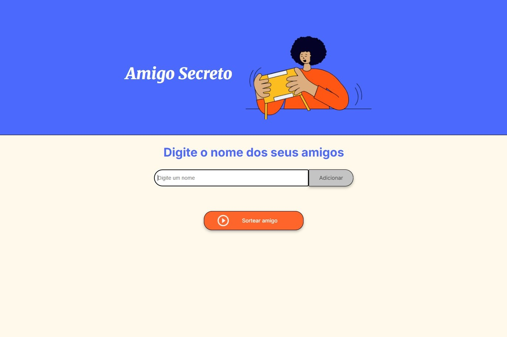
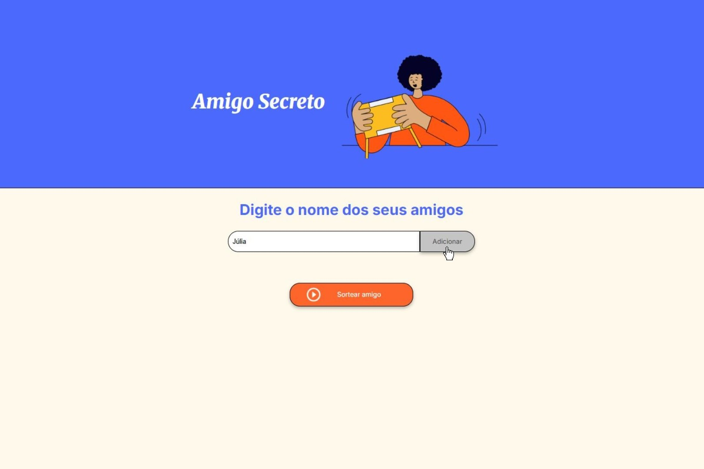
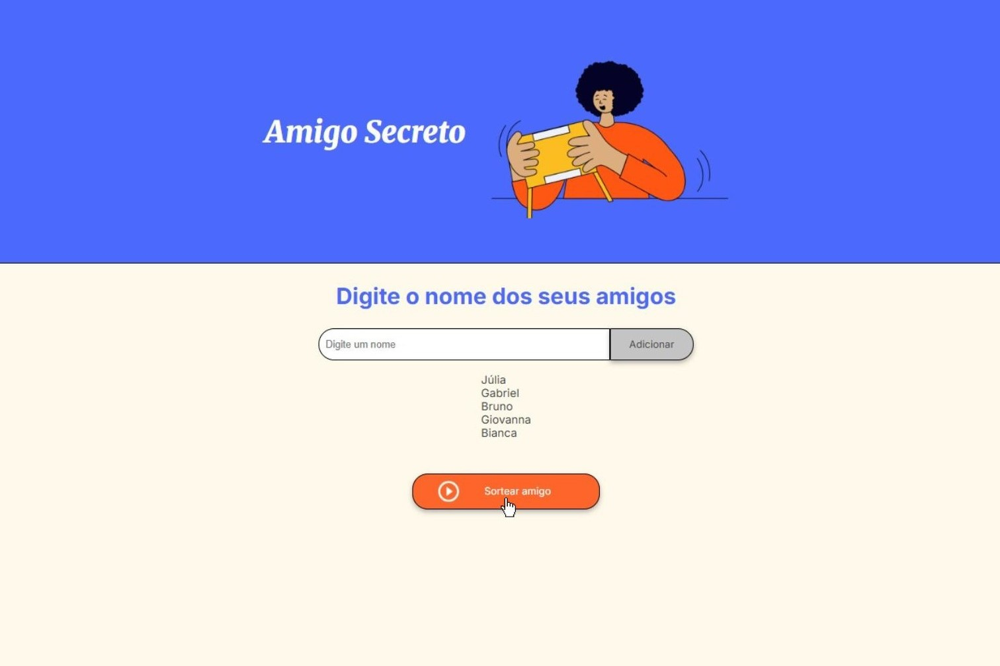
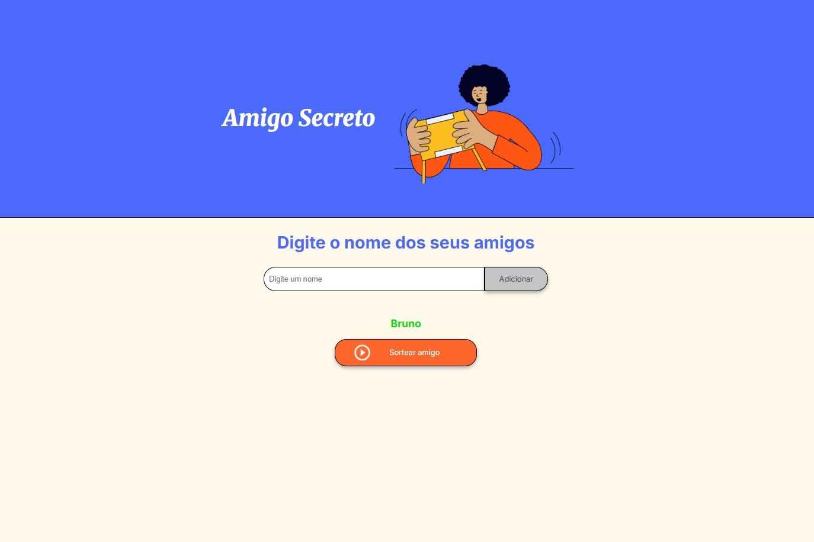

# Amigo Secreto ✨

Este projeto foi desenvolvido para sortear amigos de forma aleatória, sendo perfeito para a organização de brincadeiras de amigo secreto!

## 📝 Funcionalidades

- Adicionar uma lista de amigos ao programa.
- Sortear um amigo de forma aleatória.

## 💻 Tecnologias Utilizadas

- **Frontend**: HTML e CSS.
- **Backend**: JavaScript (JS).

## 🌐 Acesso ao Projeto

[Clique aqui para acessar o projeto no Vercel](https://projeto-amigo-secreto-chi.vercel.app/) 

[Clique aqui para acessar o projeto github.io](https://bianca-bomfim.github.io/projeto-amigo-secreto/)


## 💡 Como Rodar o Projeto


### Pré-requisitos

- Ter o [Visual Studio Code (VSCode)](https://code.visualstudio.com/) instalado, caso queira visualizar o código localmente.

### Passos

1. Clone o repositório no terminal:
   ```bash
   git clone https://github.com/bianca-bomfim/amigo-secreto
   ``` 

2. Abra o arquivo index.html no Visual Studio Code e use a extensão "Live Server" para rodar o projeto em um navegador.

    [Instalando e Rodando a Extensão](https://marketplace.visualstudio.com/items?itemName=ritwickdey.LiveServer) 
   


## 👥 Como Usar


1. Digite o nome dos amigos que participarão da brincadeira (de forma individual).


2. Clique em **"Adicionar"** para incluir cada amigo a lista. Repita o processo para adicionar todos os amigos.


3. Ao final, clique em **"Sortear amigo"** para ver o amigo sorteado.


4. O nome que aparecerá em **verde** será o seu amigo secreto.


## 🎉 Participe da Brincadeira!

Agora que você já aprendeu as funcionalidades e como utilizar o projeto, entre na brincadeira também e organize o seu amigo secreto de forma fácil e divertida! 🎁

[Clique aqui para acessar o projeto e começar!](https://amigo-secreto-seven-omega.vercel.app/)
